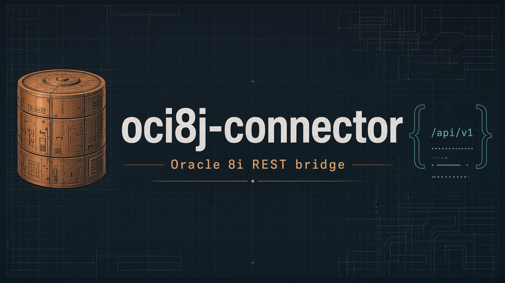

<!--
 * oci8j-connector - Oracle 8i REST API
 * Copyright (c) 2024 - 2026 Hermes Rodríguez
 * SPDX-License-Identifier: MIT
 -->

# Oracle 8i Connector v1.4.0


**Spec:** [SPEC.md](SPEC.md) · **Agents:** [AGENTS.md](AGENTS.md) · **Version:** [VERSION](VERSION) · **Changelog:** [CHANGELOG.md](CHANGELOG.md) · **Docs index:** [docs/README.md](docs/README.md)



## The problem

Many organizations still run **Oracle 8i** (or similarly old Oracle instances) that hold critical data. Modern applications — Node, Go, Python, current JDKs, cloud services — **cannot open a reliable JDBC session** to that world:

- The only workable driver is often the historical **`classes12.jar`**, which expects a **Java 8**-era runtime.
- Current Oracle JDBC drivers and Java 11+ stacks do not replace that path for 8i.
- Rewriting every consumer to speak thin JDBC + Java 8 is expensive and unsafe to scatter across the estate.
- Teams still need **HTTP/JSON** access for scripts, integrations, migrations, and controlled ops — without putting a full app server next to every client.

So the gap is: **legacy Oracle 8i on one side, modern HTTP clients on the other**, with no small, deployable bridge in between.

## The solution

**oci8j-connector** is that bridge: a small **Spring Boot 2.7 / Java 8** service that embeds `classes12.jar` and exposes a **REST API** for SQL.

| You need | You get |
|----------|---------|
| Talk to Oracle 8i from anywhere that can `curl` | `POST /api/v1/oci8j-connector/query` → JSON |
| One place that owns the old JDBC stack | Single container / JAR; clients stay modern |
| Ops-friendly deploy | Docker / Compose / Kubernetes probes (`/healthz`, `/ready` or `/readyz`) |
| Guardrails | Optional Basic Auth + forbidden SQL keywords |

Published image: `ghcr.io/hrodrig/oci8j-connector` (**linux/amd64**). Day-to-day: **`make`** (family workflow) or plain `mvn`.

> **WARNING — read before use.** This is a **legacy bridge** for Oracle **8i** on **Java 8**. It is **not** a modern hardened database gateway. Published container images are based on **Eclipse Temurin 8** and will typically report **High** OS/JRE CVEs in scanners (Grype release gate fails on **Critical** only). The bundled `classes12.jar` is **Oracle proprietary** (not MIT). Exposing SQL over HTTP is inherently risky — use only on trusted networks, with auth, keyword blocks, and your own risk acceptance. Full text: [Disclaimer](#disclaimer).

## Table of contents

- [The problem](#the-problem)
- [The solution](#the-solution)
- [Features](#features)
- [Configuration](#configuration)
  - [Security Note](#security-note)
  - [config.yaml file](#configyaml-file)
  - [Environment Variables](#environment-variables)
  - [Basic Authentication (Optional)](#basic-authentication-optional)
- [Quick Start with Make](#quick-start-with-make)
  - [Release image (CI)](#release-image-ci)
- [Using Make](#using-make)
- [Compilation and Execution (Maven)](#compilation-and-execution-maven)
- [API Endpoints](#api-endpoints)
- [Usage Examples](#usage-examples)
- [Docker](#docker)
- [Security](#security)
  - [Query Security Configuration](#query-security-configuration)
  - [General Security Notes](#general-security-notes)
- [Requirements](#requirements)
- [Project Structure](#project-structure)
- [Disclaimer](#disclaimer)
- [License](#license)

## Features

- ✅ Oracle 8i connection using `classes12.jar`
- ✅ Configuration through `config.yaml`
- ✅ Override with environment variables
- ✅ REST API for executing SQL queries
- ✅ Support for all SQL query types (SELECT, INSERT, UPDATE, DELETE, etc.)
- ✅ JSON format responses
- ✅ Health check endpoint
- ✅ Optional Basic Authentication

## Configuration

### Security Note

**Important**: This project uses a secure configuration approach:
- **Sensitive files** (like `docker-compose.yml` with real credentials) are excluded from Git
- **Example files** (like `docker-compose.example.yml`) are included for reference
- **Configuration files** use environment variables for sensitive data

### config.yaml file

The application uses `src/main/resources/config.yaml` which is safe to commit because it uses environment variables for sensitive data. For reference, you can also check `config.example.yaml`:

```yaml
oracle8i:
  host: 1.2.3.4                    # Replace with your Oracle server IP
  port: 1521                       # Replace with your Oracle port
  sid: orcl                        # Replace with your Oracle SID
  username: username               # Replace with your Oracle username
  password: password               # Replace with your Oracle password
  driver: oracle.jdbc.driver.OracleDriver
  # Query timeout (in milliseconds)
  query_timeout: 120000            # Query execution timeout (120 seconds)
```

### Environment Variables

You can override the configuration using environment variables:

```bash
export ORACLE_HOST=1.2.3.4
export ORACLE_PORT=1521
export ORACLE_SID=orcl
export ORACLE_USERNAME=username
export ORACLE_PASSWORD=password
export ORACLE_QUERY_TIMEOUT=120000
```

### Basic Authentication (Optional)

The application supports optional Basic Authentication. It's only enabled if both username and password are provided:

```yaml
basic_auth:
  enabled: true                        # Set to true to enable Basic Auth
  username: admin                      # Your desired username
  password: secretpassword             # Your desired password
```

Or using environment variables:

```bash
export BASIC_AUTH_ENABLED=true
export BASIC_AUTH_USERNAME=admin
export BASIC_AUTH_PASSWORD=secretpassword
```

**Note:** If Basic Auth is enabled, API routes (`/query`, `/info`, OpenAPI when on) require credentials. Probes (`/healthz`, `/ready`, `/readyz`) stay public by default (`edge.probes_public: true` / `PROBES_PUBLIC=true`).

### Edge, probes, hardening, OpenAPI (v1.4)

Nested YAML in `config.example.yaml` (env overrides in parentheses):

```yaml
edge:
  trusted_proxies: ""          # TRUSTED_PROXIES
  allowed_cidrs: ""            # ALLOWED_CIDRS
  probes_public: true          # PROBES_PUBLIC
  probes_allowed_cidrs: ""     # PROBES_ALLOWED_CIDRS

hardening:
  rate_limit_max: 0            # RATE_LIMIT_MAX (0 = off)
  rate_limit_window_seconds: 60
  cors_origins: ""             # CORS_ORIGINS (empty = *)

openapi:
  enabled: false               # OPENAPI_ENABLED; also on for profile dev/local
```

OpenAPI paths when enabled: `/v3/api-docs`, `/swagger-ui.html`. Full contract: [SPEC.md](SPEC.md) §7.

## Quick Start with Make

Primary entrypoint is the **Makefile** (same pattern as gghstats / pgwd / kzero). Requires Make, JDK 8+, Maven, and Docker for image builds.

```bash
# Show targets
make help

# Lint (VERSION ↔ pom ↔ Dockerfile) + tests + package
make lint
make test
make package

# Build linux/amd64 image and start compose stack
make docker-build
cp docker/docker-compose.example.yml docker/docker-compose.yml   # first time; edit secrets
make compose-up
make health

# Stop
make compose-down
```

Maven-only (no Docker):

```bash
mvn clean package
java -jar target/oracle8i-connector-1.4.0.jar
```

### Release image (CI)

Pushing annotated tag `v<VERSION>` on **`main`** runs `.github/workflows/release.yml`:

- `make release-check` (lint, test, package, Grype docker-scan)
- Push `ghcr.io/hrodrig/oci8j-connector:v<VERSION>` and `:latest` (**linux/amd64** only)
- Attach fat JAR + Syft SBOMs to the GitHub Release

Local gate before tagging: `make release-check`.

## Using Make

### Quality and build

```bash
make help
make lint              # VERSION / pom / Dockerfile sync + mvn validate
make test
make package
make release-check     # lint + test + package + docker-scan (needs Docker)
```

### Docker

```bash
make docker-build      # oci8j-connector:<VERSION> (linux/amd64)
make docker-scan       # build + Grype (--fail-on critical; High expected on Temurin 8)
make sbom              # Syft SPDX JSON under dist/
```

Images are tagged `oci8j-connector:<VERSION>` and `oci8j-connector:latest` locally. GHCR uses the `v` prefix: `ghcr.io/hrodrig/oci8j-connector:v1.4.0`.

### Compose / ops

```bash
make compose-up
make logs
make health
make compose-down
```

Version comes from the root **`VERSION`** file (must match `pom.xml` and Dockerfile).

### Example Workflow

```bash
make docker-build
make compose-up
make health
make logs
make compose-down
```

## Compilation and Execution (Maven)

### Compile

```bash
mvn clean compile
```

### Run

```bash
mvn spring-boot:run
```

### Create JAR

```bash
mvn clean package
java -jar target/oracle8i-connector-1.4.0.jar
```

## API Endpoints

### POST /api/v1/oci8j-connector/query

Executes a SQL query and returns the results in JSON format.

**Request Body:**

```json
{
  "query": "SELECT * FROM emp WHERE deptno = ?",
  "parameters": [10]
}
```

**Response (SELECT query):**

```json
{
  "success": true,
  "message": "Query executed successfully",
  "data": [
    {
      "EMPNO": 7782,
      "ENAME": "CLARK",
      "JOB": "MANAGER",
      "DEPTNO": 10
    }
  ],
  "rowCount": 1,
  "executionTimeMs": 45
}
```

**Response (INSERT/UPDATE/DELETE query):**

```json
{
  "success": true,
  "message": "Query executed successfully. 1 rows affected.",
  "data": null,
  "rowCount": 1,
  "executionTimeMs": 23
}
```

### GET /api/v1/oci8j-connector/healthz

**Liveness Probe** - Verifies the application is running (always returns 200 OK).

**Response:**

```json
{
  "status": "UP",
  "database": "CONNECTED",
  "timestamp": 1640995200000,
  "uptime": 45000
}
```

### GET /api/v1/oci8j-connector/ready

**Readiness Probe** - Verifies the application is ready to serve traffic (includes database connectivity).

Alias: **`GET /api/v1/oci8j-connector/readyz`** (same response).

**Response:**

```json
{
  "status": "READY",
  "database": "CONNECTED",
  "timestamp": 1640995200000
}
```

**Note:** Kubernetes: `/healthz` for liveness; `/ready` or `/readyz` for readiness.

### GET /api/v1/oci8j-connector/info

Gets application information.

**Response:**

```json
{
  "name": "Oracle 8i Connector",
  "version": "1.0.0",
  "description": "Oracle 8i connector using classes12.jar",
  "endpoints": {
    "query": "POST /api/v1/oci8j-connector/query",
    "healthz": "GET /api/v1/oci8j-connector/healthz",
    "info": "GET /api/v1/oci8j-connector/info"
  }
}
```

## Usage Examples

### Simple query

```bash
curl -X POST http://localhost:8080/api/v1/oci8j-connector/query \
  -H "Content-Type: application/json" \
  -d '{"query": "SELECT * FROM emp LIMIT 5"}'
```

### Query with parameters

```bash
curl -X POST http://localhost:8080/api/v1/oci8j-connector/query \
  -H "Content-Type: application/json" \
  -d '{"query": "SELECT * FROM emp WHERE deptno = ?", "parameters": [10]}'
```

### INSERT query

```bash
curl -X POST http://localhost:8080/api/v1/oci8j-connector/query \
  -H "Content-Type: application/json" \
  -d '{"query": "INSERT INTO emp (empno, ename, job, deptno) VALUES (?, ?, ?, ?)", "parameters": [9999, "TEST", "CLERK", 10]}'
```

### UPDATE query

```bash
curl -X POST http://localhost:8080/api/v1/oci8j-connector/query \
  -H "Content-Type: application/json" \
  -d '{"query": "UPDATE emp SET sal = ? WHERE empno = ?", "parameters": [5000, 9999]}'
```

### DELETE query

```bash
curl -X POST http://localhost:8080/api/v1/oci8j-connector/query \
  -H "Content-Type: application/json" \
  -d '{"query": "DELETE FROM emp WHERE empno = ?", "parameters": [9999]}'
```

### Check status

```bash
curl http://localhost:8080/api/v1/oci8j-connector/healthz
```

## Docker

### Docker Compose Setup

**Security Note**: The `docker-compose.yml` file with real credentials is excluded from Git for security reasons.

#### Quick Start (Using Make)

1. **Copy the example file:**

   ```bash
   cp docker/docker-compose.example.yml docker/docker-compose.yml
   ```

2. **Edit with your credentials:**

   ```bash
   # Edit docker/docker-compose.yml with your actual Oracle connection details
   nano docker/docker-compose.yml
   ```

3. **Build and start the service:**

   ```bash
   make docker-build    # Build the Docker image (linux/amd64)
   make compose-up      # Start the service
   ```

#### Quick Start (Using Docker Compose directly)

1. **Copy the example file:**

   ```bash
   cd docker
   cp docker-compose.example.yml docker-compose.yml
   ```

2. **Edit with your credentials:**

   ```bash
   # Edit docker-compose.yml with your actual Oracle connection details
   nano docker-compose.yml
   ```

3. **Start the service:**

   ```bash
   docker compose up -d
   ```

#### TLS reverse proxy examples

TLS terminates at the edge; the connector stays HTTP on `:8080` inside the compose network. Set `TRUSTED_PROXIES` to the compose subnet so forwarded client IPs are trusted (SPEC §7.2).

| Stack | Path |
|-------|------|
| Traefik + Let's Encrypt | `docker/tls/docker-compose.traefik-le.example.yml` |
| Traefik (file certs) | `docker/tls/docker-compose.traefik.example.yml` |
| Caddy 2 | `docker/tls/docker-compose.caddy.example.yml` |
| nginx unprivileged | `docker/tls/docker-compose.nginx.example.yml` |

See **[docker/tls/README.md](docker/tls/README.md)** for certs (`mkcert` / openssl) and `up` commands.

#### Environment Variables

The Docker Compose file supports the following environment variables:

```yaml
environment:
  # Oracle Database Configuration
  - ORACLE_HOST=your-oracle-host
  - ORACLE_PORT=1521
  - ORACLE_SID=your-sid
  - ORACLE_USERNAME=your-username
  - ORACLE_PASSWORD=your-password
  
  # Query timeout (in milliseconds)
  - ORACLE_QUERY_TIMEOUT=120000
  
  # Basic Authentication (optional)
  - BASIC_AUTH_ENABLED=false
  - BASIC_AUTH_USERNAME=admin
  - BASIC_AUTH_PASSWORD=your-secret-password

  # SPEC §7 (optional)
  - TRUSTED_PROXIES=
  - ALLOWED_CIDRS=
  - PROBES_PUBLIC=true
  - OPENAPI_ENABLED=false
```

For TLS edge stacks (Traefik / Caddy / nginx), use `TRUSTED_PROXIES=172.28.10.0/24` as in `docker/tls/*`.

#### Health Check

The container includes a health check that verifies the API is responding:

```bash
# Using Make
make health  # Check health status
make logs    # View logs

# Using Docker Compose directly
docker compose -f docker/docker-compose.yml ps
docker compose -f docker/docker-compose.yml logs -f
```

### Important Notes

- **Oracle 8i Compatibility**: The connection URL uses the simple format `jdbc:oracle:thin:@host:port:sid` without timeout parameters, as Oracle 8i's `classes12.jar` driver doesn't support them in the URL.
- **Query Timeout**: Only `query_timeout` is configurable and is applied at the JDBC template level, not in the connection URL.

## Security

### Query Security Configuration

The application supports configurable query security through a forbidden keywords list. This allows you to block specific SQL keywords to prevent potentially dangerous operations.

#### Security configuration

Add the security section to your `config.yaml`:

```yaml
# Security configuration
security:
  # List of forbidden keywords in SQL queries (empty by default)
  # Configure according to your security requirements
  forbidden_keywords: []
```

#### Example Restrictive Configuration

```yaml
security:
  forbidden_keywords:
    - "DROP"
    - "DELETE"
    - "UPDATE"
    - "INSERT"
    - "TRUNCATE"
    - "ALTER"
    - "CREATE"
    - "GRANT"
    - "REVOKE"
```

#### Behavior

- **Empty list**: No restrictions applied (default behavior)
- **Keywords configured**: Queries containing forbidden keywords are blocked
- **Case insensitive**: Validation is case-insensitive
- **Error response**: Blocked queries return a 400 error with details

#### Example Usage

```bash
# Allowed query (if no restrictions)
curl -X POST http://localhost:8080/api/v1/oci8j-connector/query \
  -H "Content-Type: application/json" \
  -d '{"query": "SELECT * FROM users WHERE id = 1"}'

# Blocked query (if DROP is in forbidden list)
curl -X POST http://localhost:8080/api/v1/oci8j-connector/query \
  -H "Content-Type: application/json" \
  -d '{"query": "DROP TABLE users"}'
# Response: {"success": false, "message": "Query blocked due to forbidden keyword: DROP"}
```

List tables for the current Oracle 8i user:

```sql
SELECT table_name FROM user_tables;
```

Scope variants:

```sql
-- All accessible tables (owned + granted)
SELECT owner, table_name FROM all_tables ORDER BY owner, table_name;

-- Full data dictionary (requires DBA / SELECT_CATALOG_ROLE)
SELECT owner, table_name FROM dba_tables;
```

Optional row counts and comments:

```sql
SELECT table_name, num_rows, last_analyzed FROM user_tables;
SELECT table_name FROM user_tab_comments WHERE table_type = 'TABLE';
```

`user_tables` is the direct answer for “my tables”. Use `all_tables` for tables visible via grants from other schemas.

#### Recommended Keywords to Block

##### DDL Commands (Data Definition Language)

- `DROP` - Delete database objects
- `CREATE` - Create database objects
- `ALTER` - Modify object structure
- `TRUNCATE` - Empty tables
- `RENAME` - Rename objects
- `COMMENT` - Add comments

##### DML Commands (Data Manipulation Language)

- `DELETE` - Delete records
- `UPDATE` - Modify records
- `INSERT` - Insert records
- `MERGE` - Combine data
- `REPLACE` - Replace data

##### Transaction Control Commands

- `COMMIT` - Commit transactions
- `ROLLBACK` - Rollback transactions
- `SAVEPOINT` - Create savepoints
- `LOCK` - Lock resources
- `UNLOCK` - Unlock resources

##### System Control Commands

- `GRANT` - Grant privileges
- `REVOKE` - Revoke privileges
- `AUDIT` - Audit actions
- `NOAUDIT` - Disable auditing
- `SHUTDOWN` - Shutdown database
- `STARTUP` - Startup database

##### Stored Procedure Commands

- `EXEC` - Execute procedures
- `EXECUTE` - Execute procedures
- `CALL` - Call procedures
- `BEGIN` - Start PL/SQL block
- `END` - End PL/SQL block
- `DECLARE` - Declare variables
- `VARIABLE` - Define variables
- `CONSTANT` - Define constants

##### Flow Control Commands

- `IF` - Conditional statements
- `CASE` - Decision structures
- `WHEN` - Conditional clauses
- `THEN` - Action clauses
- `ELSE` - Alternative clauses
- `WHILE` - Conditional loops
- `FOR` - Count loops
- `LOOP` - Infinite loops
- `REPEAT` - Loops with end condition
- `RETRY` - Retry operations
- `WAIT` - Wait operations
- `SLEEP` - Pause execution
- `DELAY` - Delay execution
- `TIMEOUT` - Time limits
- `CANCEL` - Cancel operations
- `ABORT` - Abort operations
- `KILL` - Terminate processes
- `TERMINATE` - End processes
- `SUSPEND` - Suspend processes
- `RESUME` - Resume processes

##### Optimization and Performance Commands

- `ANALYZE` - Analyze objects
- `EXPLAIN` - Explain execution plans
- `OPTIMIZE` - Optimize queries
- `TUNE` - Tune performance
- `ADVISE` - Advise optimization
- `RECOMMEND` - Recommend changes
- `SUGGEST` - Suggest improvements
- `HINT` - Optimization hints
- `PARALLEL` - Parallel execution
- `NOPARALLEL` - Disable parallelism

##### Utility Commands

- `DESCRIBE` - Describe objects
- `SHOW` - Show information
- `HELP` - Help
- `QUIT` - Quit
- `EXIT` - Exit
- `CONNECT` - Connect
- `DISCONNECT` - Disconnect
- `SET` - Set variables
- `RESET` - Reset variables
- `CLEAR` - Clear screen
- `SPOOL` - Redirect output
- `START` - Start script
- `STOP` - Stop script
- `PAUSE` - Pause execution
- `RESUME` - Resume execution

##### Recovery and Backup Commands

- `RECOVER` - Recover database
- `FLASHBACK` - Time travel
- `PURGE` - Clean obsolete data
- `BACKUP` - Backup data
- `RESTORE` - Restore data
- `LOAD` - Load data
- `COPY` - Copy data
- `IMPORT` - Import data
- `EXPORT` - Export data

##### Validation and Maintenance Commands

- `VALIDATE` - Validate data
- `INVALIDATE` - Invalidate objects
- `REFRESH` - Refresh views
- `REBUILD` - Rebuild objects
- `REORGANIZE` - Reorganize data
- `COMPILE` - Compile objects
- `DEBUG` - Debug code
- `TRACE` - Trace execution
- `PROFILE` - Profile performance

#### Security Recommendations

1. **Development**: Keep list empty for maximum flexibility
2. **Testing**: Add destructive commands (`DROP`, `DELETE`, `UPDATE`)
3. **Production**: Restrictive list with read-only commands
4. **Auditing**: Review logs for unauthorized access attempts
5. **Monitoring**: Set up alerts when forbidden keywords are detected

### General Security Notes

- All SQL query types are allowed by default (SELECT, INSERT, UPDATE, DELETE, CREATE, ALTER, DROP, etc.)
- Basic input validation (empty query check)
- Configurable keyword blocking for enhanced security
- **Warning**: This allows full database access - use with caution in production
- **Recommendation**: Configure forbidden keywords based on your security requirements

## Requirements

- Java 8+
- Maven 3.6+
- Oracle 8i with network access
- `classes12.jar` driver (included in the project)

## Project Structure

```text
src/
├── main/
│   ├── java/
│   │   └── com/connectors/oracle8i/
│   │       ├── Oracle8iConnectorApplication.java
│   │       ├── config/
│   │       │   ├── Oracle8iConfig.java
│   │       │   ├── SecurityConfig.java
│   │       │   └── QuerySecurityConfig.java
│   │       ├── controller/
│   │       │   └── Oracle8iController.java
│   │       ├── model/
│   │       │   ├── QueryRequest.java
│   │       │   └── QueryResponse.java
│   │       ├── service/
│   │       │   ├── Oracle8iService.java
│   │       │   └── BuildInfoService.java
│   │       └── security/
│   │           └── BasicAuthFilter.java
│   └── resources/
│       ├── application.yml
│       ├── application-docker.yml
│       └── config.yaml
├── lib/
│   └── classes12.jar
├── config.example.yaml
├── docker/
│   ├── Dockerfile
│   ├── docker-compose.example.yml
│   ├── docker-compose.yml
│   └── tls/                    # Traefik / Caddy / nginx-unprivileged TLS examples
├── kubernetes/
│   └── k8s-deployment.yaml
├── scripts/
│   ├── generate-build-info.sh
│   ├── start.sh
│   ├── test-api.sh
│   └── test-security.sh
├── docs/
│   └── README.md
├── assets/
│   └── oci8j-connector-hero.png
├── .github/
│   └── workflows/
│       ├── ci.yml
│       └── release.yml
├── .dockerignore
├── .gitignore
├── .gitattributes
├── AGENTS.md
├── SPEC.md
├── VERSION
├── Makefile
└── pom.xml
```

**Note**: Sensitive files like `docker-compose.yml` (with real credentials) are excluded from Git for security reasons.

## Disclaimer

**Read this section in full before building, deploying, or exposing this software.**

### Nature of this project

- **oci8j-connector** exists to talk to **legacy Oracle 8i** using the historical **`classes12.jar`** JDBC driver.
- That forces a **Java 8** runtime (and typically **Spring Boot 2.7**). Java 8 is **end-of-life**. You should expect ongoing security findings against the JDK, base OS packages, and transitive dependencies.
- This is a **compatibility / migration / lab / controlled-ops** tool — **not** a general-purpose, internet-facing database API product.

### Container images and vulnerability scans

- Published images (`ghcr.io/hrodrig/oci8j-connector`) are built from **Eclipse Temurin 8** (`linux/amd64`).
- Scanners such as **Grype** will often report **High** (and sometimes Critical) CVEs in that stack. There is **no practical “High-clean” Java 8 base image** that stays clean over time while remaining compatible with `classes12.jar`.
- The project release gate fails Grype on **Critical** by default (`GRYPE_FAIL_ON=critical`). **High findings do not block release** and must be accepted (or mitigated by you) if you run the image.
- You are responsible for whether that risk posture is acceptable in your environment (air-gapped lab vs production, network exposure, compensating controls).

### Oracle JDBC driver (`classes12.jar`)

- `lib/classes12.jar` is an **Oracle proprietary** driver. It is **not** licensed under the MIT license of this repository.
- Redistribution and use are governed by **Oracle’s terms**. Obtain and use the driver only if you are entitled to do so. The authors do not grant any Oracle rights.

### SQL over HTTP

- This service can execute SQL (subject to your forbidden-keyword configuration). A misconfiguration, weak auth, or overly permissive allow-list can destroy or exfiltrate data.
- Optional Basic Auth and keyword blocks are **best-effort controls**, not a substitute for network isolation, least privilege DB accounts, WAF, audit, and operational discipline.
- **Do not** expose this service to the public Internet without a deliberate security design you own.

### No warranty

**THE SOFTWARE IS PROVIDED "AS IS", WITHOUT WARRANTY OF ANY KIND, EXPRESS OR IMPLIED, INCLUDING BUT NOT LIMITED TO THE WARRANTIES OF MERCHANTABILITY, FITNESS FOR A PARTICULAR PURPOSE AND NONINFRINGEMENT.**

This software is provided for use at your own risk. The authors and contributors shall not be liable for any direct, indirect, incidental, special, exemplary, or consequential damages (including, but not limited to, procurement of substitute goods or services; loss of use, data, or profits; or business interruption) however caused and on any theory of liability, whether in contract, strict liability, or tort (including negligence or otherwise) arising in any way out of the use of this software, even if advised of the possibility of such damage.

**By using this software, you acknowledge that you have read this disclaimer, understand it, and agree to be bound by its terms. You assume full responsibility for any consequences that may result from the use of this software, including but not limited to:**

- Data loss or corruption
- Security breaches, CVE exposure, and scanner findings on Java 8 / Temurin images
- License compliance for Oracle JDBC and Oracle Database
- Infrastructure failures and service interruptions
- Any other damages or losses

It is your responsibility to:

- Test thoroughly in a non-production environment
- Review the code and configuration before deployment
- Implement network, auth, and database least-privilege controls appropriate to your risk
- Decide whether Temurin 8 / High CVE findings are acceptable for your use case
- Maintain backups and monitoring

## License

This project is licensed under the MIT License — see the [LICENSE](LICENSE) file for details.

**Note:** `lib/classes12.jar` is an Oracle proprietary JDBC driver and is **not** covered by this MIT license. Its use and redistribution follow Oracle’s terms. See [Disclaimer](#disclaimer).
